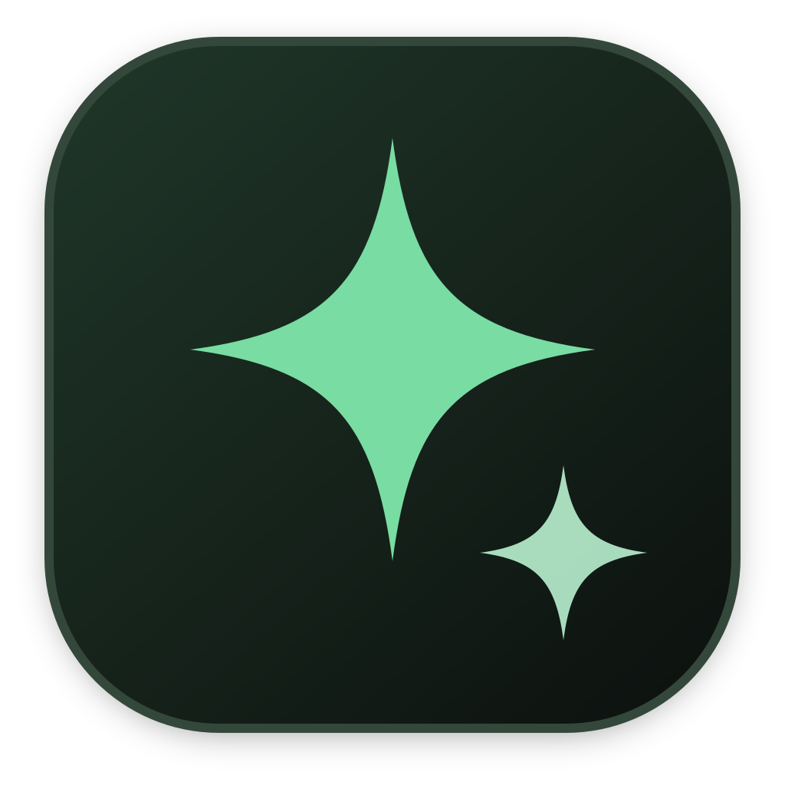

  

  <h1>Canvas</h1>
  <h3>Your ideas. At home on your Mac.</h3>

  

    A private, visual workspace for collecting sources, shaping ideas 
    and moving work forward—all from one local library.
  

  

    
    
    
  

  

    <a href="https://osirismedici.github.io/canvas/"><strong>Download for Mac</strong></a>
    ·
    <a href="https://osirismedici.github.io/canvas/#demo">Watch the demo</a>
    ·
    <a href="https://github.com/OsirisMedici/canvas/issues">Community</a>
  

1 min 50 sec silent product demo · plays automatically and loops

---

## What is Canvas?

Canvas is a local-first Mac workspace for creators, researchers, students and independent builders. It brings source material, notes, planning and visual thinking together without asking you to assemble a stack of separate tools.

Your saved library lives on your Mac. Online feeds and source fetching need an internet connection, but the material you keep remains available locally.

---

# Core features

## Collect without breaking your flow

Build Swipe boards from notes, images, videos, PDFs and web references. Follow supported creators in Discover, save promising material to Watch Later, and return when you are ready to use it.

## Turn sources into structured work

Keep research close while you write, organize ideas and tasks on Kanban boards, then move into the built-in Whiteboard when spatial thinking is the clearer tool.

## Keep a library you can recover

Export and restore a complete Canvas library—including media and workspaces—so the work is portable beyond a single app installation.

## One focused Mac workspace

Canvas is designed around a direct desktop workflow: open the app, work from your own library, quit, and return to the same material. No GitHub, Codex or Terminal setup is required to use it.

---

# Screenshots

## Whiteboard

  

## Swipe File

  

## Discover and learn

  

## Saved sources

  

## Mixed-media library

  

---

# Download and install

Download the recommended ZIP from the **[Canvas 0.1.1 public preview](https://github.com/OsirisMedici/canvas/releases/tag/v0.1.1-preview.2)**. Extract it, open the DMG, drag Canvas to Applications, then follow `START HERE.html` for the illustrated macOS approval steps.

| Requirement | Supported preview target |
| --- | --- |
| Mac | Apple Silicon, M1 or newer |
| macOS | macOS 26 or later |
| Download | About 1 GB |
| Account | None required to use Canvas |
| Audio | The product demo is silent and muted by default |

The package includes the offline guide, Canvas terms, dependency notices, corresponding third-party source companion and checksums. Keep these files together when sharing the preview.

## First-run check

1. Open Canvas and create a Swipe Board.
2. Add a note and a file.
3. Quit with <kbd>Command</kbd> + <kbd>Q</kbd>.
4. Reopen Canvas and confirm both items remain.

---

# Preview status

Canvas 0.1.1 is an early public preview. It is ad-hoc signed—not Developer ID signed or Apple-notarized—so macOS approval is manual. Updates are manual, and there is no guaranteed support window. Intel, Windows and Linux installers are not available.

Local packaged startup, save/restart, Whiteboard persistence and complete-library archive/restore are part of release verification. The owner completed the disposable-library save/reopen check for this build; installation on a separate recipient Mac remains unconfirmed. This release is not represented as stable or Apple-approved.

Canvas uses its own library, separate from Canvas Vault. When upgrading from Canvas Core, quit it and back up its library before installing Canvas. Both app names use the existing Core library; verify your content before removing only the old `Canvas Core.app` bundle. Keep every library folder.

Studio editing and portable single-board sharing are not included in this preview.

---

# Community

[Report a bug](https://github.com/OsirisMedici/canvas/issues/new?template=bug_report.yml) · [Request a feature](https://github.com/OsirisMedici/canvas/issues/new?template=feature_request.yml) · [Roadmap](ROADMAP.md) · [Download details](DOWNLOADS.md)

Reading and downloading need no GitHub account; submitting feedback does. Search [existing issues](https://github.com/OsirisMedici/canvas/issues) first and explain the problem or desired outcome with a made-up example.

> [!IMPORTANT]
> Issues and attachments are public. Never upload private libraries, personal boards, credentials, private sharing links or unredacted logs. Use [private security reporting](SECURITY.md) for suspected vulnerabilities.

Documentation corrections are welcome through pull requests. See [Contributing](CONTRIBUTING.md) and the [community guidelines](CODE_OF_CONDUCT.md).

---

# Projects we admire

Canvas is its own product, shaped by ideas we respect across the open-source community:

- **[AppFlowy](https://github.com/AppFlowy-IO/AppFlowy):** open development and user-controlled data.
- **[Logseq](https://github.com/logseq/logseq):** local-first capture becoming connected knowledge.
- **[Joplin](https://github.com/laurent22/joplin):** data portability, dependable export and flexible sync.
- **[Memos](https://github.com/usememos/memos):** private, self-hosted capture made immediate.
- **[AFFiNE](https://github.com/toeverything/AFFiNE):** writing, visual thinking and planning in one workspace.
- **[Excalidraw](https://github.com/excalidraw/excalidraw):** immediate visual thinking in an open, portable format.

Admiration does not mean every project is bundled into Canvas. Included software is identified separately in each release's dependency notices.

---

# Terms and source

Canvas's covered materials use the [Canvas Free Use License](docs/LICENSE-Canvas.txt), which permits free personal and business use and sharing unchanged official packages with their accompanying materials. Third-party licenses and prior MIT grants keep their existing rights.

This public repository contains the Canvas website, downloads and community documentation—not the application's private source. Dependency sources are supplied with the release under their own licenses.
