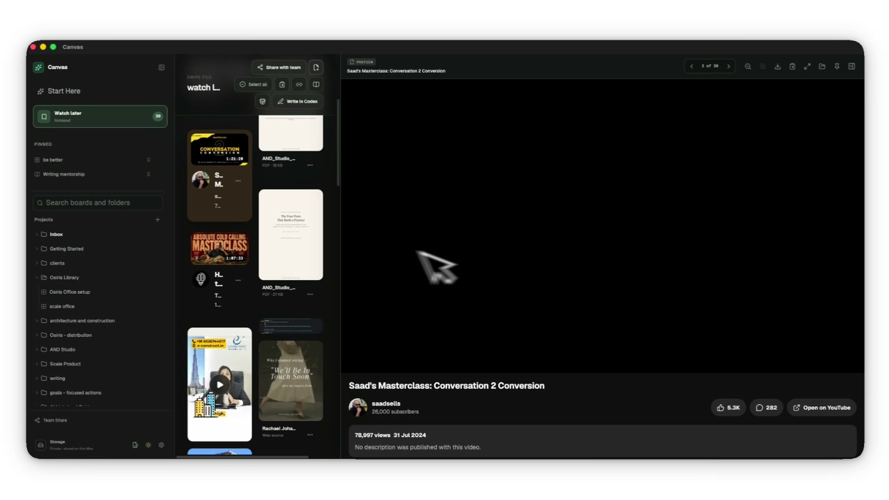

# Canvas

The public home for Canvas downloads and community feedback. The Mac app is **Canvas**, a local workspace for creators, researchers, students and independent builders.

**[Download Canvas for Mac and read the illustrated guide](https://osirismedici.github.io/canvas/)**

Canvas 0.1.1 is a free public preview for Apple Silicon Macs (M1 and newer), macOS 26 or later. It is ad-hoc signed, not Developer ID signed or Apple-notarized. Installation may require manual approval in macOS. There are no automatic updates, subscriptions for core local features, or developer-tool setup steps.

[Report a bug](https://github.com/OsirisMedici/canvas/issues/new?template=bug_report.yml) · [Request a feature](https://github.com/OsirisMedici/canvas/issues/new?template=feature_request.yml) · [Roadmap](ROADMAP.md) · [Download details](DOWNLOADS.md)

## See Canvas in action

[Watch the silent product demo](https://osirismedici.github.io/canvas/#demo) · 1 min 50 sec · no audio

## What you can do

- **Swipe boards:** collect notes, images, videos, PDFs and web references.
- **Discover:** follow supported creators and save useful material into your library.
- **Watch Later:** keep sources you want to revisit.
- **Kanban boards:** organize ideas, notes and tasks in columns.
- **Whiteboards:** sketch and arrange visual ideas with the built-in Excalidraw workspace.
- **Library recovery:** export and restore a complete Canvas library with its media and workspaces.

Saved local material lives on your Mac. Fetching online sources and feeds needs internet access. Canvas uses its own library, separate from Canvas Vault. Studio editing and portable single-board sharing are not included. Intel, Windows and Linux installers are unavailable.

## Install and try it

Download the recommended ZIP from the [preview release](https://github.com/OsirisMedici/canvas/releases/tag/v0.1.1-preview.2), extract it, open the DMG, and drag Canvas to Applications. Read START HERE.html for illustrated macOS approval steps. Create a Swipe Board, add a note and a file, quit with Command-Q, then reopen and confirm they remain.

The ZIP includes the offline guide, Canvas terms, dependency notices, corresponding third-party source companion and checksums. Keep these together when sharing it. No compilation or Terminal commands are needed. This is an early preview, with manual updates and no guaranteed support window. When upgrading from Canvas Core, quit it and back up its library before installing Canvas. Both names use the same existing Core library. Verify your content, then remove only the old Canvas Core.app bundle to avoid stale duplicates. Keep all library folders.

Local packaged startup, save/restart, Whiteboard persistence and complete-library archive/restore checks are part of release verification. The owner completed the disposable-library save/reopen test for this build; installation on a separate recipient Mac remains unconfirmed. This release is not represented as stable or Apple-approved.

## Open-source projects we admire

Canvas is its own product, shaped by ideas we respect across the open-source community:

- **[AppFlowy](https://github.com/AppFlowy-IO/AppFlowy):** for its commitment to open development and user-controlled data.
- **[Logseq](https://github.com/logseq/logseq):** for its local-first approach to turning everyday capture into connected knowledge.
- **[Joplin](https://github.com/laurent22/joplin):** for treating data portability, reliable export and flexible sync as core product promises.
- **[Memos](https://github.com/usememos/memos):** for making private, self-hosted capture simple and immediate.
- **[AFFiNE](https://github.com/toeverything/AFFiNE):** for bringing writing, visual thinking and planning together in one open workspace.
- **[Excalidraw](https://github.com/excalidraw/excalidraw):** for making visual thinking immediate and keeping drawings in an open, portable format.

Admiration does not mean that every project is bundled into Canvas. Software included in a release is identified separately in its dependency notices.

## Join the community

Reading and downloading need no GitHub account. Submitting feedback does. Search [existing issues](https://github.com/OsirisMedici/canvas/issues) before creating one. Explain the problem or outcome using a made-up example.

**Issues and attachments are public. Do not upload private libraries, personal boards, credentials, private sharing links, or unredacted logs.** Use [private security reporting](SECURITY.md) for suspected vulnerabilities. Documentation corrections are welcome through pull requests; see [Contributing](CONTRIBUTING.md) and [community guidelines](CODE_OF_CONDUCT.md).

## Terms and source

Canvas's own covered materials use the [Canvas Free Use License](docs/LICENSE-Canvas.txt), permitting free personal and business use and sharing unchanged official packages with their accompanying materials. Third-party licenses and prior MIT grants retain their existing rights. The public repository does not contain Canvas's application source; dependency sources are provided with the release under their own licenses.
